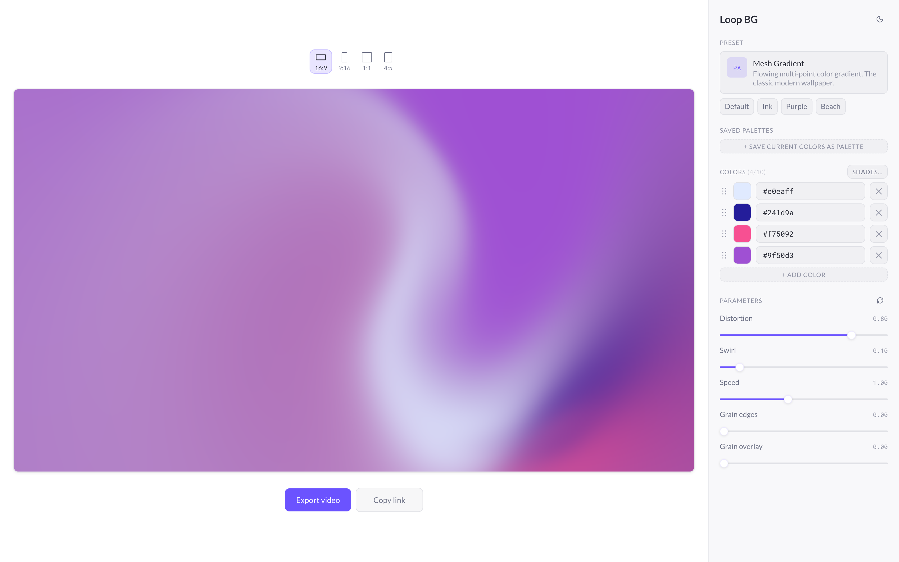

# Loop BG

Generate looping background videos in the browser.

**[Try it →](https://marbaer.github.io/loop-bg/)**



## What it does

- **20 presets** — abstract gradients, noise/warp shaders, mesh gradients, logo-based animations
- **MP4 / WebM export** at 720p / 1080p / 1440p, 30 or 60 fps. Videos loop seamlessly: hand-rolled shaders by design, paper-design shaders via ping-pong (forward, then reverse).
- **Aspect ratios**: 16:9, 9:16, 1:1, 4:5
- **Brand colors** — set HEX colors, generate shades from one color, save palettes as brand kits
- **Share links** — copy a URL of the current setup to send to others or come back to later

## How it works

Custom GLSL shaders are driven by [twgl.js](https://twgljs.org/) and rendered to an `OffscreenCanvas`. The [@paper-design/shaders-react](https://www.npmjs.com/package/@paper-design/shaders-react) presets are exported deterministically by stopping their rAF loop and stepping `ShaderMount.setFrame(ms)` frame-by-frame, so tab visibility or focus changes can't desync the capture.

Frames are encoded via `VideoEncoder` (WebCodecs) and muxed with [`mp4-muxer`](https://github.com/Vanilagy/mp4-muxer) or [`webm-muxer`](https://github.com/Vanilagy/webm-muxer). Export needs WebCodecs with H.264 (MP4) or VP9 (WebM); codec support is detected at runtime and unsupported formats are disabled in the UI.

## Project structure

```
src/
  presets/        background presets
  shaders/        GLSL for the hand-rolled shader presets
  render/         preview pipelines
  export/         WebCodecs encoder + paper-design deterministic capture
  state/          Zustand store, share-URL serialization, brand kits
  ui/             React components
  color/          palette derivation, shade generation
```
